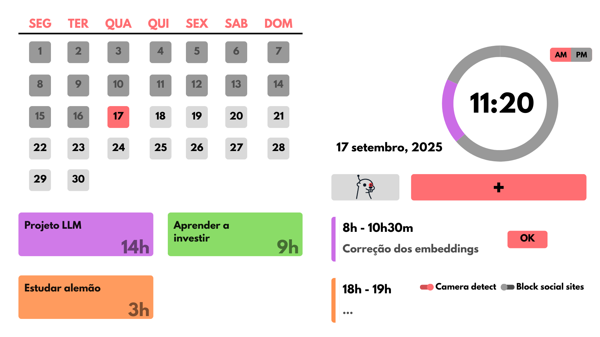

# Zaidrian

> Zaidrian é seu assistente pessoal e vai te ajudar a organizar seus projetos 🚀

## Ideia 💡

1. O assistente pergunta se o usuário quer fazer um projeto e ajuda a estabelecer as etapas do projeto
2. O assistente vai mandar notificações para incentivar o usuário a definir tarefas
  * Tarefas são períodos de tempo onde o usuário decide ficar focado em um projeto
  * Durante uma tarefa o usuário define se vai ser cobrado com detecção facial e se vai ter acesso a sites de redes sociais populares
  * A duração das tarefas são contabilizadas para cada projeto
3. No final de cada tarefa o assistente pergunta sobre o progresso do prjeto

## Ferramentas 🔧

* **Interface:** flet (biblioteca python)
* **Modelo**:** Bert Q&A (hugging face)
* **Notificações:** Threading (biblioteca python)
* **Detecção com câmera:** Opencv (biblioteca python)

## Equipe 👥

* Igor Santos
* João Anacleto
* Luiz Felipe Nast
* Thiago Giesel

